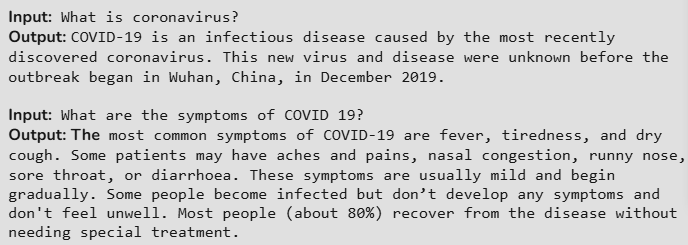

# 🦠 Corona-Help-Bot

Corona-Help-Bot is a Python-based chatbot designed to answer COVID-19 related questions using data sourced from the World Health Organization (WHO). It uses Natural Language Processing (NLP) and a deep learning neural network to classify user queries and respond intelligently.

---

## 🚀 Features
- Answers COVID-19 FAQs
- Uses WHO-based structured JSON data
- NLP with stemming and tokenization
- Neural Network with 2 hidden layers
- Bag-of-Words sentence representation
- Easily extendable with more data

---

## 🛠️ Technologies Used
- Python 3
- NumPy
- NLTK
- TensorFlow 1.15
- TFLearn

---

## 📋 Prerequisites

Make sure you have:
- Python 3 installed
- pip installed

---

## 📦 Installation Steps

1. Clone the repository
git clone https://github.com/your-username/Corona-Help-Bot.git
cd Corona-Help-Bot

2. Install dependencies
pip install -r requirements.txt

3. Run the chatbot
python main.py

---

## 📚 Training Data Format

The chatbot is trained using a JSON file (WHO.json) with the following structure:
{
  "intents": [
    {
      "tag": "symptoms",
      "patterns": ["What are the symptoms of corona?"],
      "responses": ["Common symptoms include fever, dry cough, and tiredness."]
    }
  ]
}
Key Elements:
- tag: Category of intent.
- patterns: Possible user questions.
- responses: Bot replies.

---

## 🧠 How It Works
- Bag of Words.
- Each sentence is converted into a numerical vector representing word presence (1 or 0).
- Neural Network.
- Input Layer: Bag of Words.
- Hidden Layers: 2 Fully Connected Layers.
- Output Layer: Softmax classifier.
- The model predicts the intent and selects a suitable response.

---

## 📸 Sample Output

---

## 🔮 Future Improvements
- Add more WHO data.
- Integrate speech support.
- Deploy as a web app.
